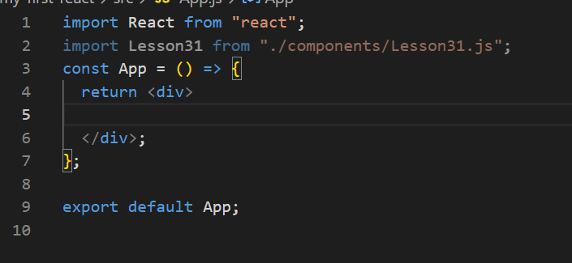
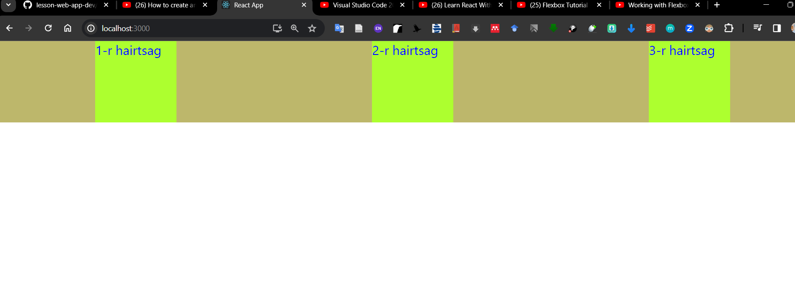

# React асаах:

1. Project folder(My first react)= луу орно:
   -View--->Terminal эсвэл табны дээд талын товч (grave~) дээр дарах
   -npm start дарна

- ls: list => ls
- cd: change directory => (cd foldername) жишээ нь cd my-first-react гэж бичнэ.
  Дараа нь асаах комманд npm start гэж бичнэ.

2. Асаах команд:

- npm start => live server

APP.Js бол хамгийн том компонент----> АPP.JS дотроо харуулмаар байгаа зүйлээ солиод харуулахад болно. Хэрэв npm start хийхэд дэлгэцэн дээр юм гарч ирж байвал тэр нь APP.Js-н return доторх нь дэлгэцэнд харагдана. Return dotroo shine component oo holboj delgetsend haruulna. Shine component uusgehdee neree bicheed JS tomoor bichne.

- 
  Дараа нь Github ruu orood saihan unsh
  -Жи
  HTML дэлгэцэнд юу харахыг харуулна.
  Return дотор бичигдсэн зүйлс дэлгэц рүү харагдана.
  file import

### Component

3. Компонент үүсгэх түлхүүр үг: rafce
   -Component Зарлах (үүсгэх), оруулж ирэх (import), Хэрэглэх (use)
   СOMPONENT ZARLAHDAA

- Component эхний үсэг томоор эхлэх
  -Функцтэй адилхан бичигдэнэ.
  -.Js өргөтгөлтэй бичнэ.
  - my-first-react => src => components дараад дараа нь Codely surgalt-n хажуугийн new file button дээр дарна
    Нэрээ томоор бичнэ. Төгсгөлд нь .js гэж бичнэ.
    rafce гэж бичнэ.
    COMPONENT IMPORTLOHDOO
    1. App.js дотор 
 энэ дотор бичнэ
; дотор нь бичнэ.
    2. <Box/> гэж нэрийг нь бичнэ.
       COMPONENT HEREGLEHDEE (Box.js-г хэрэглэхдээ)
    3. Box.js g янзлахдаа Box.css үүсгэнэ.
    4. Box.css дотор Box.js-г холбоно
       - холбохын тулд Box.js дотроо className="box" бичнэ.
       - Box.css-д .box гэж бичнэ.

5.  display: flex; флексээр дүрсийг удирдана
    flex-direction: row; Хөндлөн чиглэлд байрлуулна.
    justify-content: space-around Боксуудыг хооронд нь завсартай хөндлөн байрлуулна.

    6.  Component ruu утга дамжуулахдаа.
        Аpp.js дотор байгаа div-ийн 
 <Box text="1-r hairtsag" /> 
 гэж бичээд box.js рүү ороод
        const Box = ({ text }) => {
        return 
{text}
;}; ингэж бичнэ. Дэлгэцэн дээр нь ингэж харагдана.

              (нэг цэг. бол одоо байгаа хавтасыг заана)

        (хоёр цэг.. бол нэг одоо байгаа хавтаснаас ухраана. )
